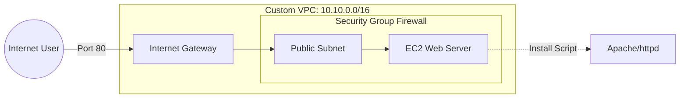

# Secure EC2 Web Server Deployment
Successfully deployed a live Apache web server on AWS using Ubuntu CLI.
##  Architecture
I built a custom network from scratch to ensure the web server was isolated and secure.
* **VPC:** 10.10.0.0/16 (Private Cloud)
* **Subnet:** Public Subnet with Internet Gateway access.
* **Security Group:** Configured as a firewall to allow only HTTP (80) and SSH (22).

##  Security Features
* **Least Privilege:** No unnecessary ports are open to the public.
* **Automation:** Used a 'User Data' script to install Apache, reducing human error.
* **Key Pair Access:** Encrypted terminal access using RSA keys.
## Architecture Diagram

